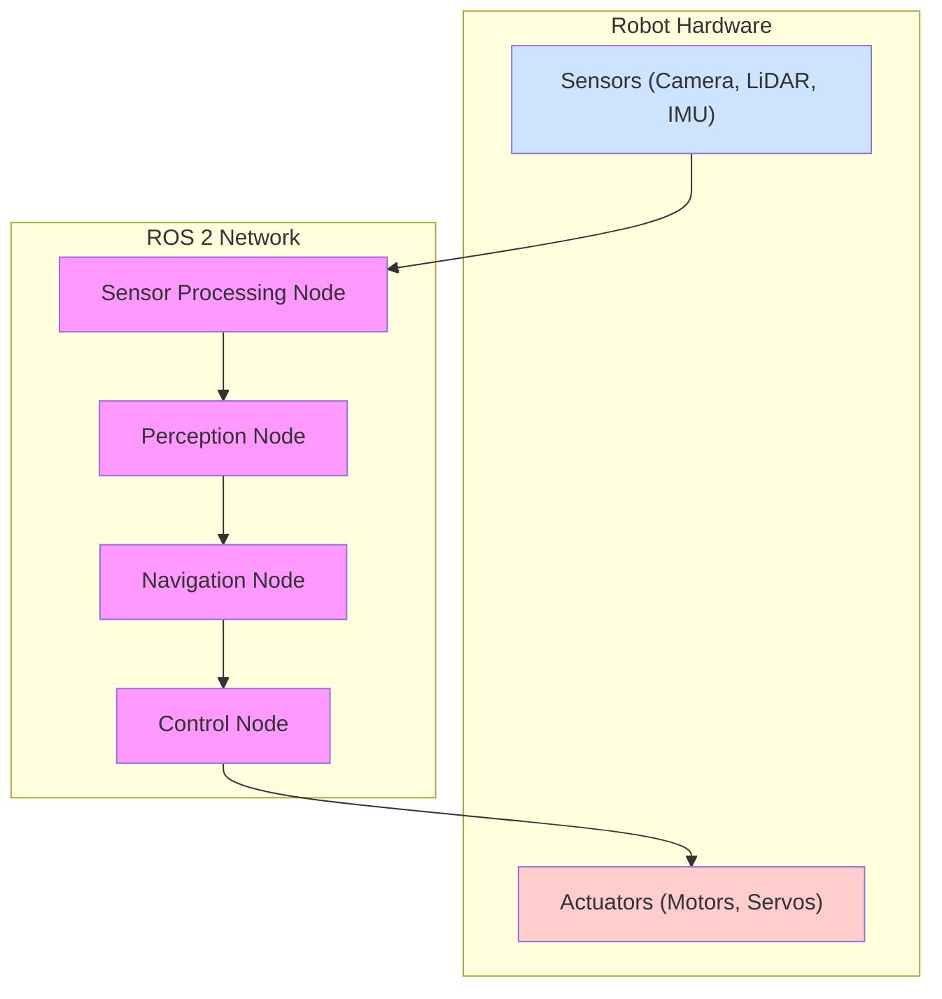
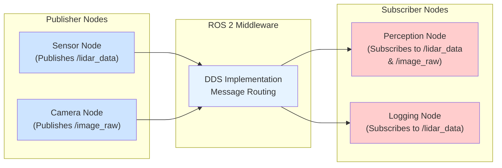
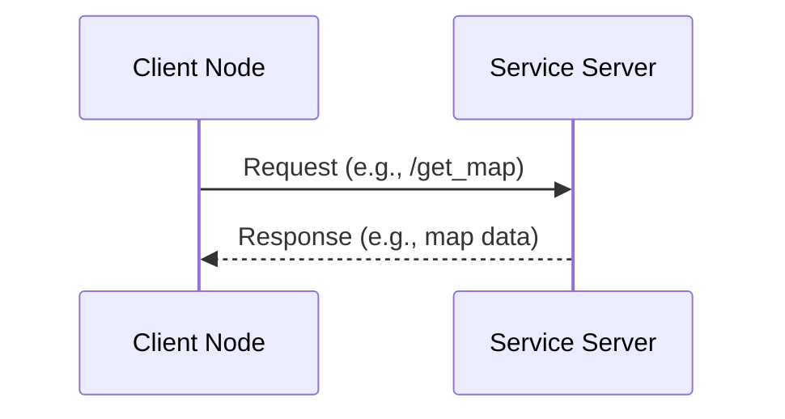
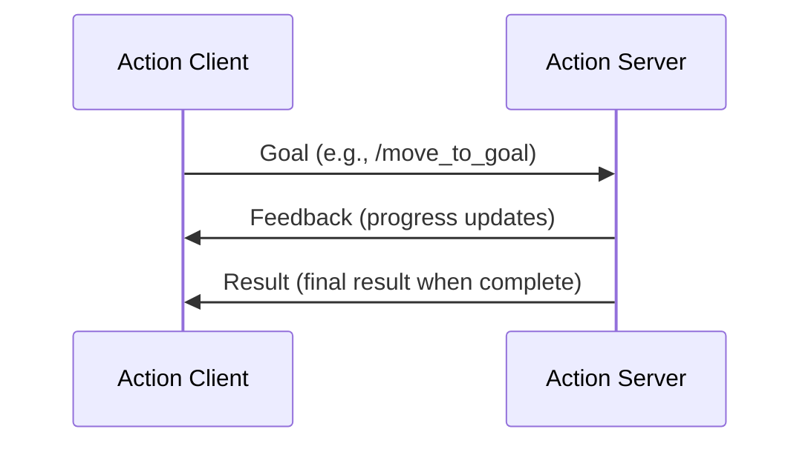

# The Robotic Nervous System (ROS 2)

## Introduction

The Robot Operating System 2 (ROS 2) serves as the nervous system for modern robots, providing a flexible framework for writing robot software. It's a middleware that helps developers create complex robotic applications by providing services such as hardware abstraction, device drivers, libraries, visualizers, message-passing, package management, and more.

## Learning Objectives

By the end of this module, you will be able to:
- Understand the fundamental concepts of ROS 2 architecture
- Create and run basic ROS 2 nodes
- Implement communication patterns using topics, services, and actions
- Work with parameter servers and lifecycle nodes
- Use ROS 2 tools for debugging and visualization

## What is ROS 2?

ROS 2 (Robot Operating System 2) is not an actual operating system but rather a flexible framework for writing robot software. It's a collection of software libraries and tools that help you build robotic applications. It provides hardware abstraction, device drivers, libraries for implementing common robotic functionality, visualizers, message-passing between processes, and package management. ROS 2 is designed to be reliable, maintainable, and suitable for real-world applications including commercial robotics and research.

This is fundamentally different from a traditional operating system, as ROS 2 is designed to be run on top of traditional operating systems like Linux, Windows, or macOS. It's better thought of as a robotics middleware or framework that provides a set of conventions and tools for building complex robotic systems. The architecture is distributed, meaning ROS 2 nodes can run on different machines and still communicate seamlessly over a network.

ROS 2 evolved from ROS 1 to address several limitations, particularly around security, real-time support, and multi-robot systems. It was designed with industrial and commercial robotics applications in mind, where reliability and maintainability are crucial. The architecture now supports multiple DDS (Data Distribution Service) implementations as its underlying communication layer, enhancing flexibility and performance.

The framework provides a number of features that make it ideal for robotics development:

- **Hardware Abstraction**: Provides standard interfaces to communicate with different types of sensors, actuators, and other hardware components.
- **Device Drivers**: Includes standard drivers for common hardware components that can be reused across different robotic platforms.
- **Libraries**: Offers libraries for common robotics functionality such as navigation, perception, and manipulation.
- **Visualizers**: Tools for visualizing sensor data, robot state, and system behavior.
- **Message Passing**: A standardized way for different processes (nodes) to communicate with each other.
- **Package Management**: A system for organizing and distributing code and resources.

## Core Architecture Concepts

### Nodes
A node is a process that performs computation. In a ROS 2 system, nodes are designed to be modular and perform specific, narrowly-focused tasks. Since a single robot's application typically requires many nodes, any number of them may run simultaneously on different devices or on the same device.

Nodes in ROS 2 are implemented as objects that inherit from the Node class in either C++ or Python. Each node contains the code for one or more callbacks that are called when messages are published to topics the node subscribes to, or when services or actions are called that the node offers. Nodes can be written in multiple languages and still communicate with one another seamlessly.

When nodes communicate with each other, they don't do so directly. Instead, they use the ROS graph, which is a network of nodes that can exchange messages. The nodes in the ROS graph are registered with a distributed naming system so that they can discover each other. A node can request services from other nodes, or publish messages to topics that other nodes subscribe to. Nodes are typically named with descriptive names that help understand their function in the system (e.g., "laser_driver", "map_server", "move_base").

Nodes also have their own lifecycle. They can be started and stopped independently, which allows for a more modular and maintainable system. The lifecycle of nodes can be managed through lifecycle nodes, which provide more controlled startup and shutdown procedures, making systems more robust and suitable for production environments.

Node communication patterns in ROS 2 utilize a publish-subscribe model, where nodes can publish data to topics that other nodes can subscribe to. This decouples the publisher from the subscriber, allowing for more flexible system designs. Nodes can also provide services, which are synchronous request-response interactions, or actions, which are asynchronous request-response with feedback for long-running operations.

## ROS 2 System Architecture Diagram



### Packages
Packages are the primary means of organizing and distributing ROS 2 code. A package contains libraries, executables, configuration files, and other resources needed to perform a specific task or set of tasks. Packages help organize code into logical groups and make it easier to share and reuse functionality.

A package is the smallest unit of functionality in ROS 2. Each package contains a package.xml manifest that describes the package's metadata, including its name, version, maintainers, dependencies, and licenses. The package.xml file is essential for the build system and for understanding the dependencies of a package.

Packages may contain different types of files:
- **Source code**: C++ and Python source files
- **Launch files**: XML files that specify which nodes to run and with what parameters
- **Configuration files**: YAML files that define node parameters
- **Message definitions**: .msg files that define the structure of messages that can be exchanged
- **Service definitions**: .srv files that define the structure of request and response messages for services
- **Action definitions**: .action files that define the structure of goal, result, and feedback messages for actions
- **Resource files**: 3D models, maps, textures, and other data files

Packages can depend on other packages, creating a dependency graph. The ROS 2 build system (based on CMake and ament) handles these dependencies when building packages, ensuring that packages are built in the correct order.

The package structure follows a standard layout that makes it easy to navigate and understand any ROS 2 package:
```
my_robot_package/
├── CMakeLists.txt
├── package.xml
├── src/
├── include/
├── launch/
├── config/
├── msg/
├── srv/
├── action/
├── test/
└── scripts/
```

This standardized structure allows ROS 2 developers to quickly understand the organization of any package they encounter. The CMakeLists.txt file contains the build instructions for C++ packages, while Python packages may use setup.py or setup.cfg for installation instructions.

ROS 2 packages can be distributed through various channels. The standard distribution is through the Robot Operating System (ROS) package repositories, which contain pre-built packages for various operating systems. Developers can also distribute packages through source repositories like GitHub or GitLab, where others can clone and build the packages themselves.

### Topics and Messages
Topics are named buses over which nodes exchange messages. Messages are the data structures that are passed between nodes. The ROS 2 messaging system is designed to be transport-layer agnostic, allowing for flexibility in how nodes communicate with each other.

Messages in ROS 2 are data packets that nodes use to communicate with each other. A message can contain different data types: integers, floating-point numbers, booleans, strings, arrays of other data types, and even nested message types. ROS 2 provides a rich set of standard message types (std_msgs) for common data types, as well as specialized message types for images (sensor_msgs), geometric transforms (geometry_msgs), navigation (nav_msgs), and many other purposes.

The publisher-subscriber pattern is fundamental to ROS 2's communication model. A publisher node sends messages to a topic, and any number of subscriber nodes can listen to that topic. This is a one-to-many communication pattern where the publisher doesn't know or care which, if any, nodes are subscribing to its messages.

Quality of Service (QoS) profiles in ROS 2 provide a way to specify important communication requirements for topics, such as reliability (reliable vs best-effort), durability (volatile vs transient-local), and history (keep-all vs keep-last). This allows ROS 2 to work in environments with varying network conditions and requirements.

ROS 2 uses a Data Distribution Service (DDS) implementation as the underlying transport mechanism. DDS provides a standardized middleware for real-time, scalable, and reliable data exchange. Different DDS implementations like Fast DDS, Cyclone DDS, and RTI Connext can be used based on the requirements of the system.

Message serialization in ROS 2 is handled transparently by the framework. When a node publishes a message to a topic, ROS 2 automatically serializes the message into a format that can be transmitted over the network. When the message reaches a subscribing node, it is automatically deserialized back into its original form. This abstraction allows developers to focus on their application logic rather than the details of data transmission.

Topics can be created for any data type that has a corresponding message definition. The message definition specifies the structure of the data that can be transmitted over that topic. For example, a topic that transmits sensor data might use a message type that includes fields for the sensor ID, timestamp, and measurement values.

Topic namespaces in ROS 2 follow a hierarchical structure similar to file paths, using forward slashes as separators. This allows for logical organization of topics, such as `/robot1/sensors/laser_scan` and `/robot2/sensors/laser_scan` for different robots in a multi-robot system.

## Topic-Based Communication Pattern



### Services
Services provide a request/response communication pattern in ROS 2. A service client sends a request message to a service server, which processes the request and sends back a response message. This pattern is useful when you need to request specific information or trigger specific actions in another node.

Unlike the asynchronous publish/subscribe model of topics, services are synchronous. When a client sends a request to a service, it waits for the response before continuing. This can be important for operations that need to complete before the client can proceed, such as getting a map from a map server or triggering a calibration procedure.

Service definitions consist of a request message and a response message. These are defined in .srv files, which contain the definition of both the request and response messages, separated by three dashes (---). For example, an AddTwoInts service would have a request with two integers (a and b) and a response with a single integer (sum).

Service servers can only have one implementation running at a time for a given service name. This is different from topics, where multiple publishers can publish to the same topic. However, multiple clients can call the same service.

The service architecture in ROS 2 supports various interaction patterns. The most common is the fire-and-forget pattern, where a client sends a request and waits for a response. However, services can also be designed to handle complex interactions where the server might need to perform multiple operations before returning a response.

Service timeouts can be configured to prevent clients from waiting indefinitely if a service doesn't respond. This is important for robust system design, as it allows the system to handle situations where a service might be temporarily unavailable or experiencing issues.

Service clients and servers can be implemented in different programming languages and still communicate seamlessly. ROS 2 handles the serialization and deserialization of service requests and responses transparently, regardless of the programming languages used by the client and server.

When designing services, it's important to consider whether the operation is better suited for a service or a topic. Services are appropriate for operations that have a clear request-response pattern and typically complete relatively quickly. For continuous data streams or operations that don't have a direct response, topics are usually more appropriate.

## Service-Based Communication Pattern



### Actions
Actions are a more advanced communication pattern that extends services to support long-running tasks. Actions enable clients to send a goal to an action server, get feedback, and receive a result. They're particularly useful for tasks that take a significant amount of time to complete.

Actions are designed for operations that have a clear beginning (the goal), ongoing status updates (feedback), and a final outcome (result). This makes them ideal for tasks like navigation to a specific location, performing manipulation tasks, or running calibration procedures that might take seconds or minutes to complete.

Actions are defined with three message types: goal, result, and feedback. The goal message contains the parameters for the action, the feedback message provides information about the progress of the action, and the result message contains the final outcome.

The action client can send a goal to the server and then monitor its progress through feedback messages. The client can also cancel the goal if needed. This provides much more control than a simple service for long-running operations.

The action architecture includes built-in support for preemption. This means that if a client sends a new goal while the server is still working on a previous goal, the server can be configured to either reject the new goal, cancel the current goal in favor of the new one, or queue the new goal for later execution.

Actions use a client-server model similar to services, but with additional capabilities for long-running tasks. The action server maintains the state of all active goals and can handle multiple goals concurrently.

The feedback mechanism in actions allows clients to provide real-time updates to users or other parts of the system about the progress of long-running operations. This enables better user experience in applications where the user needs to know the progress of an operation.

Action clients can also request the status of their goals, allowing them to determine if a goal is pending, active, succeeded, or failed. This status information helps clients implement appropriate error handling and recovery strategies.

## Action-Based Communication Pattern



## ROS 2 vs. ROS 1

ROS 2 is not simply a new version of ROS 1; it's a redesigned version that addresses many of the limitations of ROS 1. Some of the key differences include:

- **Quality of Service (QoS)**: ROS 2 provides QoS to support real-time and embedded applications. You can specify how data should be delivered (e.g., reliable vs best-effort, keep-all vs keep-last).
- **Improved real-time support**: Better support for real-time operation is available, which is essential for many robotics applications.
- **Multiple DDS implementations**: ROS 2 is built on DDS (Data Distribution Service), providing more flexibility and better performance. You can choose different DDS implementations based on your needs.
- **Security**: Security is built into ROS 2 from the ground up, with support for authentication, access control, and encryption.
- **Improved cross-platform support**: Better support for Windows and macOS, making it easier for a wider range of developers to use ROS.

Additional important differences include:

- **Better multi-robot support**: ROS 2 handles multiple robots in the same network more effectively, making it suitable for applications involving fleets of robots. This is achieved through DDS's built-in discovery mechanisms that better handle multiple domains.
- **Lifecycle management**: Support for more sophisticated node lifecycle management, making systems more robust. Lifecycle nodes provide a standardized way to handle initialization, configuration, activation, and shutdown of nodes in a coordinated manner.
- **Package build system**: A more robust and flexible build system based on CMake and ament. The ament build system is designed to handle complex dependency graphs and provides better support for mixed-language packages.
- **Middleware abstraction**: Abstracted middleware layer allowing for alternative implementations beyond DDS if needed. This makes ROS 2 more flexible and adaptable to different communication requirements.
- **Time handling**: Improved time handling with support for different types of clocks including simulation time, system time, and parameter-driven time sources.
- **Parameter handling**: Enhanced parameter system with support for parameter validation, callbacks on parameter changes, and better organization of parameters.

The migration from ROS 1 to ROS 2 requires significant changes in code structure, build system, and communication patterns. However, these changes were made to address scalability, security, and real-time performance requirements that were becoming critical for robotics applications.

## Setting Up Your Development Environment

Before diving into ROS 2 development, you'll need to set up your development environment. This involves installing ROS 2, setting up your workspace, and configuring your development tools.

For this course, we recommend using the latest stable release of ROS 2, which at the time of writing is ROS 2 Humble Hawksbill (with long-term support through May 2027). Humble Hawksbill is an LTS (Long Term Support) release that provides stability and ongoing support, making it ideal for both learning and production applications.

### Installation Steps

1. **System Requirements**: Ensure your system meets the minimum requirements. For Ubuntu, you'll need Ubuntu 22.04 (Jammy Jellyfish). For Windows, you'll need Windows 10 or later with WSL2 (Windows Subsystem for Linux) configured for optimal performance.

2. **Install Prerequisites**: Install basic tools like Python 3, pip, and development libraries. On Ubuntu:
   ```bash
   sudo apt update
   sudo apt install software-properties-common
   sudo add-apt-repository universe
   ```

3. **Add ROS 2 Repository**: Add the ROS 2 package repository to your system:
   ```bash
   sudo apt update && sudo apt install -y curl gnupg lsb-release
   sudo curl -sSL https://raw.githubusercontent.com/ros/rosdistro/master/ros.key -o /usr/share/keyrings/ros-archive-keyring.gpg
   echo "deb [arch=$(dpkg --print-architecture) signed-by=/usr/share/keyrings/ros-archive-keyring.gpg] http://packages.ros.org/ros2/ubuntu $(source /etc/os-release && echo $UBUNTU_CODENAME) main" | sudo tee /etc/apt/sources.list.d/ros2.list > /dev/null
   ```

4. **Install ROS 2**: Install the desktop variant which includes most of the commonly used packages:
   ```bash
   sudo apt update
   sudo apt install ros-humble-desktop
   ```

5. **Environment Setup**: Source the ROS 2 setup script to make ROS 2 commands available in your current shell:
   ```bash
   source /opt/ros/humble/setup.bash
   ```

6. **Install Additional Tools**: Install colcon for building packages and rosdep for managing dependencies:
   ```bash
   pip3 install -U colcon-common-extensions
   sudo apt install python3-rosdep
   sudo rosdep init
   rosdep update
   ```

### Creating a Workspace

Once ROS 2 is installed, you'll need to create a workspace for your projects:

```bash
# Create a workspace directory
mkdir -p ~/ros2_ws/src
cd ~/ros2_ws

# Build the workspace
colcon build

# Source the workspace
source install/setup.bash
```

### Development Tools

To enhance your development experience, consider installing:

- **RViz**: The ROS visualization tool for viewing robot state, sensor data, and more
- **rqt**: A Qt-based framework for GUI tools that can be used for debugging and monitoring
- **Gazebo**: A 3D simulation environment (which we'll cover in Module 2)
- **rosbags**: For recording and replaying sensor data and system behavior
- **IDE support**: Extensions for VS Code or other IDEs that provide ROS 2 syntax highlighting, debugging, and project management features

### Free-Tier Alternatives and Resources

ROS 2 development can be done entirely with free tools and resources, making it accessible for students and hobbyists:

- **Operating System**: Use Ubuntu (Linux) which is free and has the best support for ROS 2 development. You can dual-boot it with Windows or run it in a virtual machine.
- **Development Environment**: Visual Studio Code is a free, powerful editor with excellent ROS 2 extensions available. Alternatively, you can use free editors like Vim or Emacs.
- **Simulation**: Gazebo (which we'll cover in Module 2) is completely free and open-source. You can also use the newer Ignition Gazebo.
- **Version Control**: Git is free and essential for tracking changes in your ROS packages. GitHub, GitLab, and Bitbucket all offer free plans for public repositories.
- **Documentation and Learning**: The official ROS documentation, tutorials, and community forums are free resources. The ROS Discourse forum and ROS Answers Q&A site provide community support.
- **IDE Extensions**: There are free VS Code extensions for ROS 2 development that provide syntax highlighting, debugging support, and workspace management.
- **Cloud Resources**: While ROS 2 can run on your local machine, you can use free tiers of cloud providers (like AWS Free Tier, Google Cloud Free Tier, or GitHub Codespaces) to develop and test your applications in more powerful environments.
- **Free DDS Implementations**: Cyclone DDS and Fast DDS (Eclipse) are both free and open-source DDS implementations that are fully compatible with ROS 2.
- **Community Packages**: A wealth of community-developed packages are freely available through the ROS package repositories, saving you from implementing many common robotics functions from scratch.

## Code Examples

Now let's look at some practical code examples to help you understand how to implement these concepts in ROS 2.

### 1. Basic Publisher Node

```python
import rclpy
from rclpy.node import Node
from std_msgs.msg import String

class MinimalPublisher(Node):

    def __init__(self):
        super().__init__('minimal_publisher')
        self.publisher_ = self.create_publisher(String, 'topic', 10)
        timer_period = 0.5  # seconds
        self.timer = self.create_timer(timer_period, self.timer_callback)
        self.i = 0

    def timer_callback(self):
        msg = String()
        msg.data = 'Hello World: %d' % self.i
        self.publisher_.publish(msg)
        self.get_logger().info('Publishing: "%s"' % msg.data)
        self.i += 1

def main(args=None):
    rclpy.init(args=args)

    minimal_publisher = MinimalPublisher()

    rclpy.spin(minimal_publisher)

    # Destroy the node explicitly
    minimal_publisher.destroy_node()
    rclpy.shutdown()

if __name__ == '__main__':
    main()
```

### 2. Basic Subscriber Node

```python
import rclpy
from rclpy.node import Node
from std_msgs.msg import String

class MinimalSubscriber(Node):

    def __init__(self):
        super().__init__('minimal_subscriber')
        self.subscription = self.create_subscription(
            String,
            'topic',
            self.listener_callback,
            10)
        self.subscription  # prevent unused variable warning

    def listener_callback(self, msg):
        self.get_logger().info('I heard: "%s"' % msg.data)

def main(args=None):
    rclpy.init(args=args)

    minimal_subscriber = MinimalSubscriber()

    rclpy.spin(minimal_subscriber)

    # Destroy the node explicitly
    minimal_subscriber.destroy_node()
    rclpy.shutdown()

if __name__ == '__main__':
    main()
```

### 3. Service Server

```python
from example_interfaces.srv import AddTwoInts
import rclpy
from rclpy.node import Node

class MinimalService(Node):

    def __init__(self):
        super().__init__('minimal_service')
        self.srv = self.create_service(AddTwoInts, 'add_two_ints', self.add_two_ints_callback)

    def add_two_ints_callback(self, request, response):
        response.sum = request.a + request.b
        self.get_logger().info('Incoming request\na: %d b: %d' % (request.a, request.b))
        return response

def main(args=None):
    rclpy.init(args=args)

    minimal_service = MinimalService()

    rclpy.spin(minimal_service)

    rclpy.shutdown()

if __name__ == '__main__':
    main()
```

### 4. Service Client

```python
from example_interfaces.srv import AddTwoInts
import rclpy
from rclpy.node import Node

class MinimalClientAsync(Node):

    def __init__(self):
        super().__init__('minimal_client_async')
        self.cli = self.create_client(AddTwoInts, 'add_two_ints')
        while not self.cli.wait_for_service(timeout_sec=1.0):
            self.get_logger().info('service not available, waiting again...')
        self.req = AddTwoInts.Request()

    def send_request(self, a, b):
        self.req.a = a
        self.req.b = b
        self.future = self.cli.call_async(self.req)
        rclpy.spin_until_future_complete(self, self.future)
        return self.future.result()

def main(args=None):
    rclpy.init(args=args)

    minimal_client = MinimalClientAsync()
    response = minimal_client.send_request(1, 2)
    minimal_client.get_logger().info(
        'Result of add_two_ints: for %d + %d = %d' %
        (1, 2, response.sum))

    minimal_client.destroy_node()
    rclpy.shutdown()

if __name__ == '__main__':
    main()
```

### 5. Parameter Server Usage

```python
import rclpy
from rclpy.node import Node

class ParameterNode(Node):

    def __init__(self):
        super().__init__('parameter_node')

        # Declare parameters with default values
        self.declare_parameter('robot_name', 'turtlebot')
        self.declare_parameter('max_velocity', 1.0)
        self.declare_parameter('sensors', ['lidar', 'camera'])

        # Get parameter values
        robot_name = self.get_parameter('robot_name').value
        max_velocity = self.get_parameter('max_velocity').value
        sensors = self.get_parameter('sensors').value

        self.get_logger().info(f'Robot: {robot_name}, Max Velocity: {max_velocity}, Sensors: {sensors}')

def main(args=None):
    rclpy.init(args=args)

    param_node = ParameterNode()

    rclpy.spin(param_node)

    param_node.destroy_node()
    rclpy.shutdown()

if __name__ == '__main__':
    main()
```

## Summary

This chapter has introduced you to the fundamental concepts of ROS 2, the middleware that serves as the nervous system for modern robots. You've learned about nodes, packages, topics, services, and actions—the core building blocks of ROS 2 applications. In the following chapters, you'll dive deeper into each of these concepts with hands-on examples.

## References and Further Reading

The content in this chapter is based on the official ROS 2 documentation available at the [ROS 2 Documentation site](https://docs.ros.org/en/humble/). For more detailed information about any of the concepts covered in this chapter, we recommend consulting these official resources:

- [ROS 2 Concepts](https://docs.ros.org/en/humble/Concepts.html): Detailed explanations of nodes, packages, topics, services, and actions
- [ROS 2 Tutorials](https://docs.ros.org/en/humble/Tutorials.html): Hands-on tutorials to practice the concepts learned
- [ROS 2 Design](https://design.ros2.org/): In-depth information about the architecture and design decisions behind ROS 2
- [ROS 2 Quality of Service](https://docs.ros.org/en/humble/Concepts/About-Quality-of-Service-Settings.html): Detailed explanation of QoS settings
- [ROS 2 DDS Implementation](https://docs.ros.org/en/humble/Releases/Release-Humble-Hawksbill.html#dds-implementations): Information about supported DDS implementations

## Next → Chapter 2

[Continue to Chapter 2: The Digital Twin (Gazebo & Unity)](/docs/module2/digital-twin-gazebo-unity)