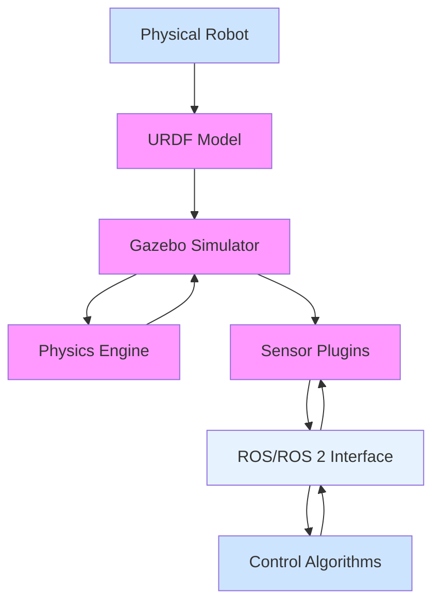

# The Digital Twin (Gazebo & Unity)

## Introduction

A digital twin is a virtual representation of a physical system that can be used for simulation, testing, and validation of robotic systems. In the context of robotics, digital twins are invaluable tools that allow engineers to test robot behaviors, sensor configurations, and control algorithms in a safe, repeatable, and cost-effective virtual environment before deploying them on physical robots.

This module introduces you to two of the most popular simulation environments in robotics: Gazebo (widely used in the ROS ecosystem) and Unity (gaining popularity for robotics simulation and AI training). Both tools offer powerful capabilities for creating digital twins of robotic systems.

## Learning Objectives

By the end of this module, you will be able to:
- Understand the concept and importance of digital twins in robotics
- Set up and configure Gazebo for robot simulation
- Create basic robot models and environments in Gazebo
- Work with simulated sensors and their data pipelines
- Understand Unity's role in robotics simulation and AI training
- Compare Gazebo and Unity for different use cases
- Integrate simulated robots with ROS/ROS 2 systems

## What is a Digital Twin?

A digital twin in robotics is a virtual replica of a physical robot or robotic system that exists within a simulation environment. This virtual replica mirrors the physical system in real-time, allowing for testing, validation, and optimization without the risks and costs associated with physical testing.

Digital twins serve several crucial purposes in robotics development:
- **Testing and Validation**: Algorithms can be tested in virtual environments before deployment on physical robots
- **Safety**: Dangerous experiments can be conducted safely in simulation
- **Rapid Prototyping**: Different design configurations and control strategies can be quickly evaluated
- **Training**: AI models can be trained on vast amounts of synthetic data generated from simulations
- **Debugging**: Complex robot behaviors can be analyzed and debugged in a controlled environment

The effectiveness of a digital twin depends on how accurately it models the physical system, including dynamics, sensing, actuation, and environmental interactions.

## Gazebo: The Robot Simulation Environment

Gazebo is a 3D simulation environment that has been widely adopted in the robotics community, particularly within the ROS ecosystem. It provides high-fidelity physics simulation, realistic rendering, and convenient robot interfaces. Originally developed by the Stanford STAIR project and later refined at the Open Source Robotics Foundation (OSRF), Gazebo has become the de facto standard for robotics simulation in the ROS ecosystem.

### Key Features of Gazebo:
- **Physics Simulation**: Accurate simulation of rigid body dynamics using ODE, Bullet, Simbody, or DART engines
- **Sensor Simulation**: Support for various sensors including cameras, LiDAR, IMUs, GPS, and more
- **Rendering**: High-quality graphics rendering for visualization and computer vision applications
- **Robot Modeling**: Support for URDF (Unified Robot Description Format) for robot models
- **ROS Integration**: Direct interfaces with ROS/ROS 2 for seamless communication
- **Plugins System**: Extensible architecture for custom sensors and controllers
- **World Creation**: Tools and formats for creating complex simulation environments
- **Realistic Environment Modeling**: Support for terrain, lighting, and weather conditions

### Gazebo Architecture

Gazebo's architecture is modular and consists of several interconnected components. The core consists of the physics engine interface, sensor processing pipeline, and rendering engine. These components are managed by the simulation server (gzserver) which runs the simulation in the background, and the GUI client (gzclient) which handles visualization and user interaction.

The physics engine abstracts the underlying physics calculations, allowing users to switch between different engines depending on their requirements. The ODE (Open Dynamics Engine) is the default and most widely used, offering a good balance of performance and accuracy. Bullet offers more advanced features, while Simbody provides high-fidelity simulation for biomechanics applications.

Gazebo's sensor simulation pipeline is designed to closely match real-world sensor behavior. For example, camera sensors in Gazebo produce images with realistic noise, distortion, and lighting effects. LiDAR sensors simulate beam properties, range limitations, and accuracy characteristics similar to their physical counterparts.

### Gazebo vs Real World Considerations

When using Gazebo for robotics development, it's important to understand the differences between simulation and reality. While Gazebo excels at simulating rigid body dynamics and basic sensor behavior, there are aspects of the real world that are difficult to simulate accurately. These include complex material properties, complex environmental effects (like dust, rain, or electromagnetic interference), and subtle behaviors that emerge from the interaction of many small imperfections in physical systems.

Gazebo simulation quality depends heavily on the accuracy of the robot model. Parameters such as mass, center of mass, inertia tensors, and friction coefficients must be accurately specified for the simulated robot to behave similarly to the physical robot. Similarly, environmental properties like surface friction, restitution coefficients, and material properties must be accurately modeled for realistic interaction.

### ROS Integration and Message Types

Gazebo's integration with ROS is one of its key strengths. The gazebo_ros_pkgs package provides plugins that bridge between the native Gazebo message system and ROS message types. This allows the same ROS nodes to operate on both simulated and physical robot data, minimizing code changes when transitioning from simulation to hardware.

The most common interfaces include:
- **Joint State Publisher**: Publishes joint states for robot model visualization
- **Differential Drive Controller**: Simulates basic two-wheeled robot control
- **Ackermann Drive Controller**: For car-like robots with steering
- **Joint Position/Velocity/effort Controllers**: For controlling individual joints
- **Camera and Sensor Interfaces**: For sensor data handling

This integration enables what's known as "hardware-in-the-loop" testing, where portions of a robot's control system can be tested with a real robot using simulated sensors or vice versa.



Gazebo operates by taking robot models defined in URDF and simulating their interactions with the environment and other objects using physics engines. Sensor plugins generate realistic sensor data that can be published to ROS topics, enabling the same code to run both in simulation and on physical robots with minimal changes.

## Unity in Robotics

Unity, traditionally known as a game development platform, has become increasingly important in robotics, particularly for AI and machine learning applications. Its real-time rendering capabilities and support for procedural content generation make it ideal for generating large amounts of synthetic training data for AI models. Unity's physically-based rendering (PBR) pipeline and advanced lighting systems create highly realistic environments that can help bridge the gap between simulation and reality.

Unity's adoption in robotics has been accelerated by several factors. First, its graphics capabilities far exceed those of traditional robotics simulators, making it ideal for computer vision applications. Second, its development tools and workflow are more familiar to the AI community than traditional robotics tools. Third, its asset store and large community provide access to countless models, environments, and tools that can be readily adapted for robotics applications.

### Key Features of Unity for Robotics:
- **High-Fidelity Rendering**: Photorealistic rendering for computer vision training
- **Procedural Generation**: Tools for generating diverse training environments
- **ML-Agents**: Framework for training AI using reinforcement learning
- **Cross-Platform**: Deploy to multiple platforms including VR/AR
- **Asset Store**: Vast library of models, environments, and tools
- **Robot Frameworks**: Integration with tools like Unity Robotics, ROS# and ML-Agents
- **Lighting Systems**: Advanced global illumination and lighting for realistic scenes
- **Physics Engine**: NVIDIA PhysX engine for accurate physics simulation
- **Animation Tools**: Sophisticated animation tools for robot kinematics simulation
- **Scripting Environment**: C# scripting with familiar development tools

### Unity vs Traditional Simulators

Unity differs from traditional robotics simulators like Gazebo in several key aspects. While Gazebo prioritizes physics accuracy and ROS integration, Unity prioritizes visual fidelity and development workflow. This makes Unity more appropriate for certain applications, particularly those involving computer vision, perception, and learning.

In Unity, the development process is more artistic and iterative, similar to game development. Users create scenes by placing and configuring objects in a visual editor, then attach scripts to control behavior. This contrasts with Gazebo's more engineering-oriented approach where environments are typically specified through XML configuration files.

For perception tasks, Unity's rendering pipeline can produce images that are nearly indistinguishable from real camera feeds, which is critical for training computer vision systems. Unity's material system supports PBR workflows, allowing for realistic simulation of surface properties, lighting conditions, and camera effects.

Unity's ML-Agents framework provides a complete reinforcement learning pipeline that includes support for training multiple agents simultaneously, curriculum learning, and imitation learning. This makes it particularly powerful for training complex robot behaviors that would be difficult to program explicitly.

However, Unity also has limitations for robotics simulation. Its physics simulation, while good, is generally less accurate than specialized robotics simulators. Integration with ROS requires additional packages like Unity Robotics Hubs' ROS-TCP-Connector. The licensing model may not be suitable for all commercial applications (though Unity has free personal editions).

### Synthetic Data Generation

One of Unity's most valuable contributions to robotics is synthetic data generation. By creating diverse, labeled datasets in simulation, robotics teams can train perception systems without needing to collect expensive real-world data. Unity's randomization tools allow for domain randomization, where environmental parameters are varied widely to train robust perception systems that can generalize to real-world conditions.

Synthetic data is particularly valuable for training neural networks for tasks like object detection, semantic segmentation, and depth estimation. These networks require large amounts of labeled training data, which is expensive and time-consuming to collect in the real world. Synthetic data provides unlimited training examples with perfect ground truth annotations.

Unity's real-time rendering capabilities make it particularly valuable for generating synthetic datasets for computer vision and perception tasks, where photorealistic rendering can help bridge the "reality gap" between simulation and real-world performance.

## Setting Up Gazebo

### Installation and Prerequisites
Gazebo can be installed as part of the ROS distribution or as a standalone application. The most common approach is to install it through ROS:

```bash
# For ROS 2 Humble Hawksbill on Ubuntu 22.04
sudo apt install ros-humble-gazebo-*
```

This installs all the necessary packages to interface Gazebo with ROS 2, including launch files, ROS interfaces, and commonly used plugins. It's important to note that Gazebo has specific system requirements, including OpenGL 2.1 or later for visualization. On systems without dedicated graphics cards, you may need to install software rendering libraries like Mesa.

### Basic Gazebo Components

Gazebo consists of several key components:
- **Server (gzserver)**: The physics simulation and sensor backend
- **Client (gzclient)**: The visualizer with user interface
- **Plugins**: Extensions that provide sensors, controllers, and interfaces
- **Models**: 3D representations of robots and objects
- **Worlds**: Scenes that define the environment for simulation

The server component handles the physics simulation and sensor processing in the background. It can run without a GUI, which is useful for running simulations on servers or headless systems. The client component provides the visual interface that allows users to see the simulation and interact with it.

### Creating Your First Simulation

A basic Gazebo simulation consists of a world file that defines the environment and models that populate it. World files are XML documents that specify the physics parameters, lighting, models, and their initial positions.

World files can range from simple empty environments to complex indoor and outdoor scenes with detailed geometry, lighting, and environmental conditions. Gazebo ships with numerous pre-built world files that can be used as starting points for your own simulations.

### Configuring Physics Parameters

Physics parameters in Gazebo control how objects move and interact. These include gravity settings (which can be modified for simulating different environments), friction coefficients, and collision properties. Careful tuning of these parameters is important for achieving realistic simulation results.

The physics engine parameters affect simulation accuracy and performance. Higher accuracy typically requires more computational resources. Finding the right balance between accuracy and performance is important for efficient simulation workflows.

## Sensor Simulation in Gazebo

One of Gazebo's strengths is its ability to simulate various sensors realistically. Simulated sensors produce data that closely matches their physical counterparts, allowing for development and testing of perception algorithms.

### Common Simulated Sensors:
- **Cameras**: RGB, depth, and stereo cameras with realistic noise models
- **LiDAR**: 2D and 3D laser scanners with configurable resolution and range
- **IMU**: Inertial measurement units with configurable noise characteristics
- **GPS**: Global positioning system simulation with configurable accuracy
- **Force/Torque Sensors**: Simulated force and torque measurements
- **Contact Sensors**: Detection of contact between objects

Each sensor type has configurable parameters to match the specifications of real sensors, such as field of view, resolution, noise characteristics, and update rates.

### Camera Simulation

Camera sensors in Gazebo are particularly important for computer vision applications. They can simulate both RGB cameras and depth cameras with realistic noise models, distortion effects, and exposure settings. The camera simulation accounts for lighting conditions in the environment, meaning that objects appear differently under different lighting conditions just as they would in reality.

Gazebo's camera simulation can also implement stereo vision capabilities, providing both left and right camera feeds with appropriate parallax for depth estimation. This is useful for applications that require real-time depth perception.

### LiDAR Simulation

LiDAR simulation in Gazebo is highly configurable and can simulate both 2D and 3D LiDAR sensors with various specifications. The simulation accounts for ray tracing, occlusion, and even multi-return capabilities of real LiDAR sensors.

Parameters that can be configured include the number of beams, angular resolution, range, and noise characteristics. This level of configuration allows for simulating specific LiDAR models like the Hokuyo UTM-30LX or Velodyne VLP-16.

The LiDAR simulation in Gazebo uses the underlying physics engine to determine where laser rays intersect with objects in the environment, providing realistic scan data including ghost readings and missed detections that occur in real sensors under certain conditions.

### IMU Simulation

IMU sensors in Gazebo provide simulated accelerometer, gyroscope, and magnetometer data with configurable noise characteristics that match real IMU sensors. This is important for robot localization and control systems that rely on IMU data.

The simulation accounts for the physical motion of the robot, correctly calculating linear acceleration and angular velocity as the robot moves, rotates, or experiences external forces.

## ROS Integration

Gazebo's tight integration with ROS/ROS 2 is one of its greatest strengths. This integration allows simulated sensors to publish data to the same topics as their physical counterparts, and simulated actuators to respond to the same commands as physical devices.

### Key ROS Interfaces:
- **Topic Bridges**: Convert between Gazebo messages and ROS messages
- **Service Servers**: Provide access to Gazebo simulation services
- **Action Servers**: Control simulation behaviors like pausing and resetting
- **TF Publishers**: Publish transforms between simulation frames
- **Robot State Publishers**: Publish joint states and robot poses

This integration means that the same ROS nodes that control a physical robot can typically control its digital twin in simulation with minimal or no modifications.

### Working with URDF Models

URDF (Unified Robot Description Format) is the standard format for representing robot models in ROS. This format describes the robot's physical structure, including links, joints, and their properties. In simulation, URDF files can be enhanced with Gazebo-specific extensions that define how the robot interacts with the simulation environment.

These extensions include visual properties (how the robot appears in simulation), collision properties (how it interacts with other objects), and inertial properties (how it moves under forces). Sensor definitions are also added to specify where sensors are mounted on the robot and how they should behave.

### Unity Robotics Integration

Unity's integration with ROS follows a different approach than Gazebo but achieves similar goals. The Unity Robotics Hubs' project provides the necessary tools to connect Unity simulations with ROS. The core component is the ROS-TCP-Connector, which establishes communication between Unity and ROS via TCP/IP.

The integration process involves creating a Unity scene with robot models and sensors, then using the connector to publish and subscribe to ROS topics. Unity's visual editor makes it easy to place sensors and customize their properties through a graphical interface.

To integrate Unity with ROS, developers typically create custom C# scripts that handle ROS communication. These scripts subscribe to ROS topics to receive commands and publish sensor data back to ROS topics. The Unity Robotics package provides helper classes to simplify this process.

### Unity ML-Agents Framework

The Unity ML-Agents framework is particularly powerful for robotics applications. It provides a complete pipeline for training intelligent agents using reinforcement learning and imitation learning. This can be used to develop complex robot behaviors that would be difficult to program explicitly.

ML-Agents uses Python API for controlling Unity environments and training the agents, while the simulation runs in Unity. This allows robot control algorithms to be implemented in Python using familiar libraries like TensorFlow or PyTorch, while taking advantage of Unity's high-quality physics and rendering.

## Unity Robotics Simulation

Unity provides a different approach to robotics simulation, focusing on high-fidelity graphics and machine learning applications. The Unity Robotics package provides interfaces to connect Unity simulations with ROS/ROS 2.

### Unity Robotics Components:
- **ROS-TCP-Connector**: Communication layer between Unity and ROS
- **Robotics Simulation Library**: Tools for creating robotics-specific simulations
- **ML-Agents Integration**: Framework for training AI in simulated environments
- **Synthetic Data Generation**: Tools for creating training datasets

Unity's strength lies in its ability to generate synthetic datasets with perfect ground truth information, which is invaluable for training computer vision and perception systems.

## Simulation Fidelity and the Reality Gap

One of the key challenges in robotics simulation is ensuring that algorithms trained in simulation will perform well on physical robots. This challenge is known as the "reality gap."

### Key Factors in Simulation Fidelity:
- **Physics Modeling**: How accurately the simulation matches real physics
- **Sensor Modeling**: How closely simulated sensors match real sensors
- **Environmental Modeling**: How well the simulation represents the real environment
- **Actuator Modeling**: How accurately simulated actuators match real actuators

Advanced simulation techniques include domain randomization (training in varied simulated environments) and system identification (calibrating simulation parameters to match real robot behavior).

## Best Practices for Digital Twin Development

Creating effective digital twins requires attention to several key principles:

1. **Model Accuracy**: Ensure physical parameters match the real robot as closely as possible
2. **Validation**: Regularly validate simulation results against physical tests
3. **Simplified Models**: Use simplified models where possible to improve simulation speed
4. **Modular Design**: Structure simulations to allow for easy modification and extension
5. **Documentation**: Maintain detailed documentation of simulation assumptions and limitations

## Free-Tier Alternatives and Resources

Developing digital twins and simulation environments can be accomplished with free tools:

- **Gazebo**: Completely free and open-source, part of the Robot Operating System ecosystem
- **Unity Personal**: Free for individuals and small companies (revenue under $200K)
- **Blender**: Free 3D modeling tool for creating custom robot and environment models
- **OpenRAVE**: Open-source robotics simulation environment
- **CoppeliaSim**: Has a free version with substantial functionality
- **Webots**: Completely free and open-source robotics simulator
- **Free Datasets**: Various synthetic and real robotics datasets are available for training
- **Community Models**: Many robot models are freely available in URDF format

## Code Examples

### Example 1: Simple Gazebo Launch File
```xml
<?xml version="1.0"?>
<launch>
  <!-- Start Gazebo with an empty world -->
  <include file="$(find gazebo_ros)/launch/empty_world.launch">
    <arg name="world_name" value="worlds/empty.world"/>
    <arg name="paused" value="false"/>
    <arg name="use_sim_time" value="true"/>
    <arg name="gui" value="true"/>
    <arg name="headless" value="false"/>
    <arg name="debug" value="false"/>
  </include>
</launch>
```

### Example 2: Basic Robot Model (URDF)
```xml
<?xml version="1.0"?>
<robot name="simple_robot">
  <!-- Base link -->
  <link name="base_link">
    <visual>
      <geometry>
        <box size="0.5 0.5 0.2"/>
      </geometry>
      <material name="blue">
        <color rgba="0 0 1 1"/>
      </material>
    </visual>
    <collision>
      <geometry>
        <box size="0.5 0.5 0.2"/>
      </geometry>
    </collision>
    <inertial>
      <mass value="1"/>
      <inertia ixx="1" ixy="0" ixz="0" iyy="1" iyz="0" izz="1"/>
    </inertial>
  </link>

  <!-- Simple wheel -->
  <link name="wheel">
    <visual>
      <geometry>
        <cylinder radius="0.1" length="0.05"/>
      </geometry>
      <material name="black">
        <color rgba="0 0 0 1"/>
      </material>
    </visual>
  </link>

  <!-- Joint connecting wheel to base -->
  <joint name="wheel_joint" type="continuous">
    <parent link="base_link"/>
    <child link="wheel"/>
    <origin xyz="0 0 -0.15" rpy="0 0 0"/>
    <axis xyz="0 1 0"/>
  </joint>
</robot>
```

### Example 3: Gazebo Configuration for Robot
```xml
<?xml version="1.0"?>
<robot>
  <!-- Gazebo-specific configurations -->
  <gazebo reference="base_link">
    <material>Gazebo/Blue</material>
    <turnGravityOff>false</turnGravityOff>
  </gazebo>

  <gazebo reference="wheel">
    <material>Gazebo/Black</material>
  </gazebo>

  <!-- Differential drive controller -->
  <gazebo>
    <plugin name="differential_drive_controller" filename="libgazebo_ros_diff_drive.so">
      <ros>
        <namespace>/simple_robot</namespace>
        <remapping>cmd_vel:=cmd_vel</remapping>
        <remapping>odom:=odom</remapping>
      </ros>
      <left_joint>wheel_joint</left_joint>
      <right_joint>wheel_joint</right_joint>
      <wheel_separation>0.3</wheel_separation>
      <wheel_diameter>0.2</wheel_diameter>
      <max_wheel_torque>20</max_wheel_torque>
      <max_wheel_acceleration>1.0</max_wheel_acceleration>
    </plugin>
  </gazebo>
</robot>
```

## Summary

Digital twins are essential tools in modern robotics development, allowing for safe, efficient, and cost-effective testing and validation. Gazebo and Unity provide complementary capabilities - Gazebo excels in physics-accurate simulation with tight ROS integration, while Unity offers high-fidelity graphics and machine learning capabilities. Understanding both tools and their appropriate use cases is crucial for developing effective robotic systems.

## References and Further Reading

The content in this chapter is based on the official documentation available at:
- [Gazebo Documentation](http://gazebosim.org/)
- [Unity Robotics Hub](https://github.com/Unity-Technologies/Unity-Robotics-Hub)
- [ROS Robot Simulator Tutorials](https://classic.gazebosim.org/tutorials)
- [Gazebo Sensor Documentation](http://gazebosim.org/tutorials?tut=ros_gzplugins#sensor)
- [Unity ML-Agents Documentation](https://github.com/Unity-Technologies/ml-agents)
- [ROS with Unity Integration Guide](https://github.com/Unity-Technologies/Unity-Robotics-Hub/blob/main/tutorials/ros_unity_integration.md)
- [Gazebo Physics Configuration](http://gazebosim.org/tutorials?tut=physics&cat=simulation)
- [Unity Physics Documentation](https://docs.unity3d.com/Manual/PhysicsSection.html)

## Next → Chapter 3

[Continue to Chapter 3: The AI-Robot Brain (NVIDIA Isaac™)](/docs/module3/ai-robot-brain-nvidia-isaac)