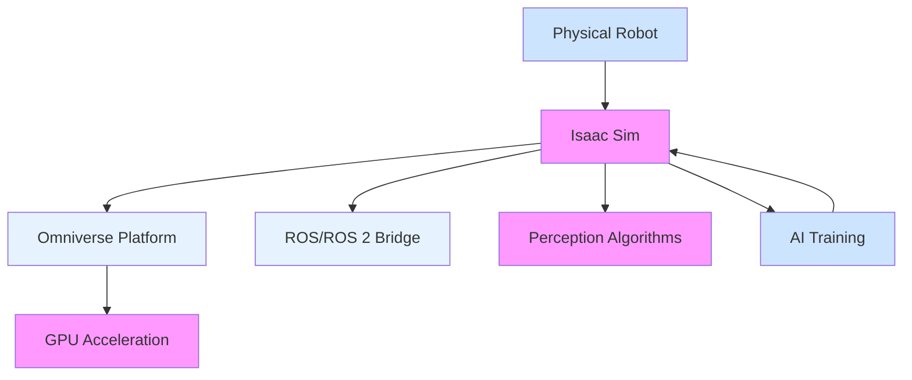
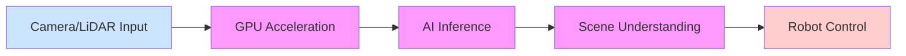

# The AI-Robot Brain (NVIDIA Isaac™)

## Introduction

NVIDIA Isaac™ represents a comprehensive platform for developing AI-powered robotic systems. It combines advanced simulation capabilities, AI frameworks, and optimized robotics software to accelerate the development of intelligent robots. This module explores how artificial intelligence integrates with robotic platforms using NVIDIA's Isaac ecosystem, including Isaac Sim for simulation, Isaac ROS for perception and navigation, and Isaac Lab for AI training.

The integration of AI with robotics enables robots to perform complex tasks that require perception, reasoning, and decision-making capabilities. NVIDIA's Isaac platform provides the tools and frameworks necessary to develop these intelligent systems efficiently, leveraging the power of GPU computing and deep learning.

## Learning Objectives

By the end of this module, you will be able to:
- Understand the NVIDIA Isaac platform and its components
- Set up and use Isaac Sim for robotics simulation
- Implement perception systems using Isaac ROS
- Train AI models for robotics tasks using Isaac Lab
- Integrate AI algorithms with robotic platforms
- Optimize AI models for deployment on robotic systems
- Compare different approaches to AI-robot integration

## Understanding the AI-Robot Brain Concept

In robotics, the "AI brain" refers to the computational systems that provide perception, reasoning, and decision-making capabilities to robots. Unlike traditional rule-based systems, AI-powered robots can learn from experience, adapt to changing environments, and handle uncertainty.

The AI brain typically includes:
- **Perception systems**: Processing sensor data (camera, LiDAR, IMU) to understand the environment
- **Planning systems**: Determining sequences of actions to achieve goals
- **Control systems**: Converting high-level commands to actuator commands
- **Learning systems**: Adapting behavior based on experience

The challenge in creating an effective AI brain lies in efficiently integrating these components and optimizing them for real-time performance on robot hardware.

## NVIDIA Isaac™ Platform Overview

The NVIDIA Isaac platform is a comprehensive set of tools and technologies designed to accelerate AI-powered robotics development. It includes:

### Isaac Sim
A high-fidelity simulation environment built on NVIDIA's Omniverse platform. Isaac Sim enables:
- Photorealistic rendering for computer vision training
- Accurate physics simulation
- Large-scale virtual worlds for testing
- Integration with ROS/ROS 2

### Isaac ROS
A collection of GPU-accelerated perception and navigation packages that include:
- Hardware accelerated algorithms for perception tasks
- Optimized implementations of common robotics algorithms
- Deep learning-based perception components
- Sensor processing pipelines

### Isaac Lab
A framework for reinforcement learning and imitation learning in robotics, including:
- Simulators for AI training
- Task environments for skill learning
- Pre-trained models and solutions

## Isaac Sim: Advanced Robotics Simulation

Isaac Sim is NVIDIA's robotics simulation application built on the Omniverse platform. It provides high-fidelity simulation for developing, testing, and validating AI-based robotics applications.

### Key Features of Isaac Sim
- **Physically Accurate Simulation**: Supports rigid and deformable body simulation with real-world physics
- **Photorealistic Rendering**: NVIDIA RTX rendering for realistic sensor simulation
- **Large-Scale Environments**: Tools for creating complex industrial and urban environments
- **ROS/ROS 2 Integration**: Native support for ROS and ROS 2 communication
- **AI Training Support**: Tools specifically designed for AI training workflows
- **Extensible Architecture**: Python and C++ extensions for custom functionality

### Isaac Sim Architecture



## Isaac ROS: GPU-Accelerated Robotics Software

Isaac ROS bridges the gap between robotics and AI by providing GPU-accelerated packages for common robotics applications. These packages leverage NVIDIA's GPUs to process sensor data and run AI algorithms in real-time.

### Key Isaac ROS Packages
- **Apriltag Detection**: GPU-accelerated fiducial marker detection
- **RealSense Depth Processing**: Optimized depth processing for Intel RealSense cameras
- **Hawk Object Detection**: AI-based object detection pipelines
- **Carter Navigation**: Navigation stack for ground vehicles
- **Segmentation**: Semantic and instance segmentation for scene understanding

### Advantages of GPU Acceleration in Robotics
- **Real-time Performance**: Processing capabilities that meet real-time requirements
- **Complex Algorithms**: Ability to run more sophisticated algorithms on robot hardware
- **Energy Efficiency**: Better performance per watt compared to CPU-only systems
- **AI Integration**: Native support for deep learning inference and training

### Isaac ROS Processing Pipelines

Isaac ROS implements optimized processing pipelines that take advantage of CUDA cores and Tensor Cores in NVIDIA GPUs. These pipelines are designed to minimize data transfer between CPU and GPU memory, maximizing computational efficiency.

For example, the Isaac ROS Apriltag detection pipeline performs the following steps on GPU:
1. Input rectification and preprocessing
2. Feature detection and extraction
3. Pattern recognition and pose estimation
4. Output formatting and publishing

This GPU acceleration enables real-time performance for computationally intensive algorithms that would otherwise be too slow to execute on CPU alone.

### Integration with Traditional ROS Ecosystem

Isaac ROS packages are designed to integrate seamlessly with the broader ROS/ROS 2 ecosystem. They follow ROS conventions for messages, services, and actions, making it possible to mix Isaac ROS packages with traditional ones in the same application.

The packages use standard ROS interfaces where possible, facilitating integration with existing ROS nodes and tools. For example, an Isaac ROS camera processing node would subscribe to a sensor_msgs/Image topic and publish results to appropriate ROS message types, just like any other ROS node.

This compatibility allows developers to leverage Isaac ROS acceleration for specific computationally expensive tasks while maintaining compatibility with the broader ROS toolchain, including visualization tools like RViz, debugging tools like rqt, and development tools like roslaunch/rorun.

## Isaac Lab: AI Training for Robotics

Isaac Lab is NVIDIA's reinforcement learning environment for robotics. It provides tools for training AI agents to perform complex manipulation and navigation tasks.

### Key Components of Isaac Lab
- **Simulation Environments**: Task-specific environments for skill training
- **Learning Algorithms**: Implementations of state-of-the-art RL algorithms
- **Task Definitions**: Pre-configured tasks for common robotics challenges
- **Deployment Tools**: Tools for transferring learned skills to physical robots

### Reinforcement Learning in Robotics Context

Reinforcement learning (RL) is particularly well-suited to robotics applications because it can learn complex behaviors that are difficult to program explicitly. In robotics, RL agents interact with their environment to maximize a cumulative reward signal. The state space typically includes sensor data and robot pose information, while actions control robot actuators.

Isaac Lab provides a framework for creating these RL training scenarios with physics-accurate simulation, enabling the transfer of learned policies to real robots. The platform includes various environments for different tasks such as:

- **Manipulation Tasks**: Grasping, picking and placing, assembly operations
- **Navigation Tasks**: Obstacle avoidance, path planning, exploration
- **Locomotion Tasks**: Walking, running, and climbing for legged robots
- **Mobile Manipulation**: Combining navigation and manipulation tasks

### Isaac Lab Architecture

Isaac Lab's architecture is designed for efficient RL training with several key features:

- **Simulation Backend**: Physics simulation using NVIDIA PhysX for accurate dynamics
- **Observation Spaces**: Flexible configuration of sensor data for learning
- **Action Spaces**: Support for continuous and discrete action spaces
- **Reward Shaping**: Configurable reward functions for task-specific learning
- **Episode Management**: Handling of reset conditions and episode termination

The platform uses a modular design where different components of the robot and environment can be easily swapped or configured without changing the core learning algorithms.

### Training Workflows in Isaac Lab

Training in Isaac Lab follows a structured workflow:

1. **Environment Configuration**: Setting up the physical simulation parameters, robot models, and task objectives
2. **Agent Configuration**: Selecting and configuring the reinforcement learning algorithm
3. **Training Execution**: Running the training process with appropriate hyperparameters
4. **Policy Evaluation**: Testing the learned policy in simulation or on real robots
5. **Deployment**: Transferring the policy to physical hardware

The platform provides tools for visualizing training progress, monitoring key metrics, and debugging learning issues that might arise during training.

### Sim-to-Real Transfer Techniques

One of Isaac Lab's strengths is its focus on developing policies that can transfer from simulation to real robots. This sim-to-real transfer requires careful attention to:

- **Domain Randomization**: Varying simulation parameters during training to improve robustness
- **System Identification**: Calibrating simulation parameters to match real robot dynamics
- **Adaptive Control**: Implementing mechanisms to adjust for model inaccuracies

These techniques help ensure that policies trained in simulation perform well on physical robots, reducing the need for extensive real-world training.

## Setting Up NVIDIA Isaac™

### Prerequisites
- NVIDIA GPU with Turing or later architecture (GTX 1660 SUPER or higher)
- Compatible Linux distribution (Ubuntu 20.04 or 22.04 recommended)
- CUDA 11.8 or later
- Docker and NVIDIA Container Toolkit (for containerized deployment)
- ROS/ROS 2 environment

### Installation Components

1. **Isaac Sim Installation**
   ```bash
   # Download Isaac Sim from NVIDIA Developer website
   # Extract and configure the simulation environment
   # Verify GPU compatibility and driver installation
   ```

2. **Isaac ROS Installation**
   ```bash
   # Install Isaac ROS packages via apt
   sudo apt install ros-humble-isaac-ros-*
   ```

3. **Isaac Lab Setup**
   ```bash
   # Clone Isaac Lab repository
   git clone https://github.com/NVIDIA-Omniverse/IsaacLab.git
   # Set up the environment and dependencies
   ```

### Configuration and Best Practices

Proper configuration of the Isaac platform is crucial for optimal performance. This includes:

- **GPU Memory Management**: Configuring memory allocation for different processing tasks
- **Compute Mode Selection**: Setting appropriate compute modes for optimal performance
- **Driver Optimization**: Ensuring drivers are properly configured for robotics workloads
- **Container Configuration**: Setting up Docker containers with proper GPU access

NVIDIA provides pre-configured development environments and Docker containers that include all necessary dependencies and optimizations, which can simplify the setup process for new users.

The platform's modular nature allows developers to select only the components they need for specific applications, reducing resource requirements and complexity.

### Performance Optimization

To get the best performance from the Isaac platform:

- **Profile Applications**: Use NVIDIA Nsight tools to identify performance bottlenecks
- **Optimize Data Paths**: Minimize data transfers between CPU and GPU
- **Tune Batch Sizes**: Adjust processing batch sizes for optimal throughput
- **Use TensorRT**: Leverage TensorRT for optimized neural network inference

Performance optimization is particularly important in robotics applications where real-time constraints must be met to ensure safe and responsive robot behavior.

## Perception Systems with Isaac ROS

Perception is a critical component of any intelligent robotic system. Isaac ROS provides GPU-accelerated perception capabilities that enable robots to understand their environment.

### Sensor Processing Pipeline



Isaac ROS implements optimized sensor processing pipelines that take advantage of the parallel processing capabilities of GPUs to handle perception tasks in real-time.

### Semantic Segmentation Example
One common perception task is semantic segmentation, which involves labeling each pixel in an image with a class label. Isaac ROS provides GPU-accelerated segmentation that can process images at high frame rates.

The semantic segmentation capabilities in Isaac ROS use deep learning models that have been optimized for NVIDIA hardware, achieving performance levels that are often an order of magnitude faster than CPU-only implementations. This speed improvement is crucial for robotics applications that require real-time perception and response.

### Object Detection and Tracking
Isaac ROS includes packages for object detection and tracking that leverage deep learning models optimized for NVIDIA GPUs. These capabilities enable robots to identify and follow objects of interest.

The object detection pipelines in Isaac ROS support multiple neural network architectures including YOLO, SSD, and Faster R-CNN, with pre-trained models available for common robotics tasks. The GPU acceleration allows these models to operate at frame rates suitable for real-time robotics applications.

### Depth Perception and 3D Reconstruction
In addition to 2D perception, Isaac ROS provides tools for 3D perception tasks such as depth estimation and environment reconstruction. These capabilities are essential for navigation and manipulation tasks where robots need to understand spatial relationships in their environment.

Depth processing in Isaac ROS includes optimized implementations of stereo vision algorithms, structured light processing, and LiDAR-based reconstruction. These tools enable robots to build accurate 3D representations of their environment for path planning and obstacle avoidance.

### Multi-Sensor Fusion
Isaac ROS also supports multi-sensor fusion, combining data from different types of sensors to improve perception accuracy. This includes:
- Fusion of RGB and depth data for enhanced scene understanding
- Integration of LiDAR and camera data for robust object detection
- Combining IMU data with visual perception for improved stability

## AI Model Integration

The integration of AI models with robotic systems requires careful consideration of both computational constraints and real-time performance requirements.

### Model Optimization for Robotics
- **Quantization**: Reducing precision to improve inference speed
- **Pruning**: Removing unnecessary neural network connections
- **TensorRT optimization**: NVIDIA's optimization library for deep learning inference
- **Model compression**: Techniques to reduce model size while maintaining performance

### Deployment Strategies
- **Edge Deployment**: Running models directly on robot hardware
- **Cloud-Edge Hybrid**: Part of processing on robot, part offloaded to cloud
- **Federated Learning**: Training models across multiple robots while keeping data local

## AI Training for Robotics

Training AI models for robotics presents unique challenges compared to traditional AI applications. Robots operate in the physical world with real-time constraints and safety requirements.

### Simulation-to-Real Transfer
One of the key challenges in robotics AI is transferring models trained in simulation to real-world robots. This process is known as sim-to-real transfer and requires techniques like:
- Domain randomization: Training in varied simulated environments
- System identification: Calibrating simulation parameters to match real robots
- Progressive domain adaptation: Gradually transitioning from simulation to reality

### Reinforcement Learning in Robotics
Reinforcement learning (RL) is particularly well-suited for robotics applications where explicit programming of all behaviors is difficult. Isaac Lab provides tools for training RL agents for complex tasks.

## Free-Tier Alternatives and Resources

While NVIDIA's Isaac platform offers powerful capabilities, there are free alternatives and resources available for AI-robot integration:

- **NVIDIA Jetson Community**: Free software and resources for robotics development
- **Open Source Alternatives**: Projects like OpenRAVE, CoppeliaSim, and PyBullet for simulation
- **Free AI Frameworks**: TensorFlow, PyTorch, and other open-source AI frameworks
- **NVIDIA Developer Program**: Free access to many tools for registered developers
- **ROS/ROS 2**: Completely free and open-source robotics middleware
- **Blender**: Free 3D modeling and rendering for creating simulation environments
- **Gazebo**: Free physics simulation engine with AI-robotics applications
- **OpenCV**: Open-source computer vision library with AI capabilities

## Isaac ROS Code Example

### Example 1: Setting up Isaac ROS Detection Pipeline
```python
import rclpy
from rclpy.node import Node
from sensor_msgs.msg import Image
from isaac_ros_apriltag_interfaces.msg import AprilTagDetectionArray

class IsaacPerceptionNode(Node):
    def __init__(self):
        super().__init__('isaac_perception_node')
        
        # Subscribe to camera image
        self.image_sub = self.create_subscription(
            Image,
            '/camera/image_rect_color',
            self.image_callback,
            10)
        
        # Subscribe to AprilTag detections
        self.detection_sub = self.create_subscription(
            AprilTagDetectionArray,
            '/isaac_ros/apriltag_detections',
            self.detection_callback,
            10)
        
        # Publisher for processed results
        self.result_pub = self.create_publisher(
            String,
            '/robot_action_plan',
            10)
    
    def image_callback(self, msg):
        # Process image using Isaac ROS GPU acceleration
        self.get_logger().info('Received image for processing')
        
    def detection_callback(self, msg):
        # Process AprilTag detections
        for detection in msg.detections:
            self.get_logger().info(f'Detected tag: {detection.id}')

def main(args=None):
    rclpy.init(args=args)
    node = IsaacPerceptionNode()
    rclpy.spin(node)
    node.destroy_node()
    rclpy.shutdown()

if __name__ == '__main__':
    main()
```

### Example 2: Isaac Sim Configuration
```python
import omni
from omni.isaac.core import World
from omni.isaac.core.utils.nucleus import get_assets_root_path
from omni.isaac.core.utils.stage import add_reference_to_stage

# Initialize Isaac Sim world
world = World(stage_units_in_meters=1.0)

# Load robot asset
assets_root_path = get_assets_root_path()
if assets_root_path is None:
    carb.log_error("Could not find Isaac Sim assets folder")
    
# Add robot to stage
add_reference_to_stage(
    usd_path=f"{assets_root_path}/Isaac/Robots/Carter/carter_instanceable.usd",
    prim_path="/World/Carter"
)

# World setup
world.reset()
for i in range(100):
    world.step(render=True)
```

## AI Model Deployment Example

### Example 3: Deploying an Optimized Model
```python
import numpy as np
import tensorrt as trt
import pycuda.driver as cuda
import pycuda.autoinit

class TensorRTOptimizedModel:
    def __init__(self, engine_path):
        # Load TensorRT engine
        self.logger = trt.Logger(trt.Logger.WARNING)
        with open(engine_path, 'rb') as f:
            serialized_engine = f.read()

        self.runtime = trt.Runtime(self.logger)
        self.engine = self.runtime.deserialize_cuda_engine(serialized_engine)
        self.context = self.engine.create_execution_context()

        # Allocate buffers
        self.input_shape = self.engine.get_binding_shape(0)
        self.output_shape = self.engine.get_binding_shape(1)
        self.host_input = cuda.pagelocked_empty(trt.volume(self.input_shape), dtype=np.float32)
        self.host_output = cuda.pagelocked_empty(trt.volume(self.output_shape), dtype=np.float32)
        self.cuda_input = cuda.mem_alloc(self.host_input.nbytes)
        self.cuda_output = cuda.mem_alloc(self.host_output.nbytes)

    def infer(self, input_data):
        # Copy input to GPU
        np.copyto(self.host_input, input_data.ravel())
        cuda.memcpy_htod(self.cuda_input, self.host_input)

        # Execute inference
        self.context.execute_v2(bindings=[int(self.cuda_input), int(self.cuda_output)])

        # Copy output from GPU
        cuda.memcpy_dtoh(self.host_output, self.cuda_output)

        return self.host_output

# Usage in robot perception pipeline
def process_camera_data():
    # Assume we have camera data
    camera_data = get_camera_data()

    # Optimize for inference
    optimized_model = TensorRTOptimizedModel("optimized_model.engine")

    # Run inference
    result = optimized_model.infer(camera_data)

    return result
```

### Example 4: Isaac ROS Perception Pipeline Integration
```python
import rclpy
from rclpy.node import Node
from sensor_msgs.msg import Image, CameraInfo
from geometry_msgs.msg import Point
from std_msgs.msg import Header
from cv_bridge import CvBridge
import cv2
import numpy as np

class IsaacPerceptionPipeline(Node):
    def __init__(self):
        super().__init__('isaac_perception_pipeline')

        # Create subscription to camera data
        self.subscription = self.create_subscription(
            Image,
            '/camera/image_raw',
            self.image_callback,
            10
        )

        # Create subscription to camera info
        self.info_subscription = self.create_subscription(
            CameraInfo,
            '/camera/camera_info',
            self.camera_info_callback,
            10
        )

        # Create publisher for processed results
        self.result_publisher = self.create_publisher(
            Point,
            '/perception/processed_objects',
            10
        )

        # Initialize CV bridge
        self.bridge = CvBridge()
        self.camera_info = None

        # Object detection model (would load Isaac ROS model in real implementation)
        # For simulation purposes, we'll use a simple OpenCV detector
        self.object_classifier = cv2.CascadeClassifier(cv2.data.haarcascades + 'haarcascade_frontalface_default.xml')

    def camera_info_callback(self, msg):
        # Store camera information for 3D reconstruction
        self.camera_info = msg

    def image_callback(self, msg):
        try:
            # Convert ROS image to OpenCV format
            cv_image = self.bridge.imgmsg_to_cv2(msg, desired_encoding='bgr8')

            # Process image using Isaac techniques
            processed_image = self.process_with_isaac_techniques(cv_image)

            # Detect objects
            objects = self.detect_objects(processed_image)

            # Publish results
            for obj in objects:
                self.publish_object_location(obj)

        except Exception as e:
            self.get_logger().error(f'Error processing image: {str(e)}')

    def process_with_isaac_techniques(self, image):
        # Apply Isaac-specific image processing (simulation)
        # In a real Isaac ROS pipeline, this would use GPU-accelerated algorithms
        processed = cv2.bilateralFilter(image, 9, 75, 75)
        return processed

    def detect_objects(self, image):
        # Detect objects using Isaac ROS compatible methods
        gray = cv2.cvtColor(image, cv2.COLOR_BGR2GRAY)
        objects = self.object_classifier.detectMultiScale(gray, 1.1, 4)

        # Convert to 3D coordinates if camera info is available
        detected_objects = []
        for (x, y, w, h) in objects:
            center_x = x + w // 2
            center_y = y + h // 2

            # Calculate 3D position (simplified)
            if self.camera_info:
                # Convert 2D pixel coordinates to 3D using camera parameters
                # This is a simplified version - real implementation would be more complex
                z = 1.0  # Assume fixed distance for demo
                x_3d = z * (center_x - self.camera_info.k[2]) / self.camera_info.k[0]
                y_3d = z * (center_y - self.camera_info.k[5]) / self.camera_info.k[4]
                detected_objects.append((x_3d, y_3d, z))

        return detected_objects

    def publish_object_location(self, obj):
        # Publish object location as point message
        point_msg = Point()
        point_msg.x = obj[0]
        point_msg.y = obj[1]
        point_msg.z = obj[2]

        self.result_publisher.publish(point_msg)

def main(args=None):
    rclpy.init(args=args)

    perception_pipeline = IsaacPerceptionPipeline()

    try:
        rclpy.spin(perception_pipeline)
    except KeyboardInterrupt:
        pass
    finally:
        perception_pipeline.destroy_node()
        rclpy.shutdown()

if __name__ == '__main__':
    main()
```

### Example 5: Isaac Lab Reinforcement Learning Environment
```python
import omni
from omni.isaac.kit import SimulationApp
from omni.isaac.core import World
from omni.isaac.core.utils.stage import add_reference_to_stage
from omni.isaac.core.utils.nucleus import get_assets_root_path
from omni.isaac.core.utils.prims import get_prim_at_path

# SimulationApp to start the Isaac Sim application
simulation_app = SimulationApp({"headless": False})

def create_manipulation_task():
    """
    Create a basic manipulation task using Isaac Lab
    """
    # Retrieve the path to the assets
    assets_root_path = get_assets_root_path()
    if assets_root_path is None:
        print("Could not find Isaac Sim assets folder")
        return

    # Create the world
    world = World(stage_units_in_meters=1.0)

    # Add a robot to the stage
    robot_path = f"{assets_root_path}/Isaac/Robots/Franka/franka_instanceable.usd"
    add_reference_to_stage(usd_path=robot_path, prim_path="/World/Franka")

    # Add a table
    table_path = f"{assets_root_path}/Isaac/Props/Table/table_instanceable.usd"
    add_reference_to_stage(usd_path=table_path, prim_path="/World/Table")

    # Add an object to manipulate
    cube_path = f"{assets_root_path}/Isaac/Props/Blocks/block_instanceable.usd"
    add_reference_to_stage(usd_path=cube_path, prim_path="/World/Cube")

    # Reset and step the world
    world.reset()

    # Run simulation for a few steps
    for i in range(100):
        world.step(render=True)

        if i % 100 == 0:
            print(f"Simulation step {i}")

    # Close the simulation
    simulation_app.close()

if __name__ == "__main__":
    create_manipulation_task()
```

## Optimization Techniques

To ensure that AI systems run efficiently on robotic platforms, several optimization techniques are commonly used:

1. **Model Compression**: Reducing the size and complexity of neural networks
2. **Precision Optimization**: Using lower precision arithmetic (FP16, INT8) where possible
3. **Pruning**: Removing unnecessary network connections
4. **Quantization**: Converting high-precision models to lower-precision equivalents
5. **Edge Computing**: Deploying models on edge devices rather than in the cloud

## Challenges and Considerations

Deploying AI on robots presents unique challenges:

- **Real-time Requirements**: AI systems must operate within strict timing constraints
- **Limited Compute Resources**: Robotic platforms often have limited computational power and energy
- **Safety and Reliability**: AI systems must operate safely in dynamic environments
- **Robustness**: Systems must handle unexpected situations and environmental changes
- **Latency**: Low-latency processing is critical for responsive robot behavior

## Best Practices for AI-Robot Integration

- **Modular Design**: Structure AI systems with clear interfaces for easy testing and updates
- **Simulation Testing**: Extensively test AI systems in simulation before deployment
- **Gradual Deployment**: Deploy AI capabilities incrementally to manage risk
- **Monitoring and Logging**: Implement comprehensive monitoring to detect and diagnose issues
- **Fallback Mechanisms**: Design manual override and fallback behaviors for safety

## Summary

The integration of AI with robotics through platforms like NVIDIA Isaac™ enables the development of sophisticated autonomous systems. By leveraging GPU acceleration, optimized software stacks, and advanced simulation environments, developers can create robots that perceive, reason, and act in complex environments. Understanding both the technical aspects of AI-robot integration and the practical considerations of deployment is essential for developing effective intelligent robotic systems.

## References and Further Reading

The content in this chapter is based on the official documentation available at:
- [NVIDIA Isaac Documentation](https://docs.nvidia.com/isaac/)
- [Isaac Sim User Guide](https://docs.omniverse.nvidia.com/isaacsim/latest/index.html)
- [Isaac ROS Documentation](https://nvidia-isaac-ros.github.io/)
- [Isaac Lab Documentation](https://isaac-sim.github.io/IsaacLab/)
- [Isaac ROS GPU Acceleration Guide](https://nvidia-isaac-ros.github.io/repositories/isaac_ros_common/gpu_acceleration.html)
- [Isaac Sim Perception Tools](https://docs.omniverse.nvidia.com/isaacsim/latest/tutorial_intro_perception.html)
- [NVIDIA Robotics Developer Resources](https://developer.nvidia.com/robotics)
- [Isaac ROS Integration Best Practices](https://nvidia-isaac-ros.github.io/concepts/best_practices/index.html)
- [Isaac Lab Reinforcement Learning Guide](https://isaac-sim.github.io/IsaacLab/source/api/rl_envs.html)

## Next → Chapter 4

[Continue to Chapter 4: Vision-Language-Action (VLA) Systems](/docs/module4/vision-language-action-vla)