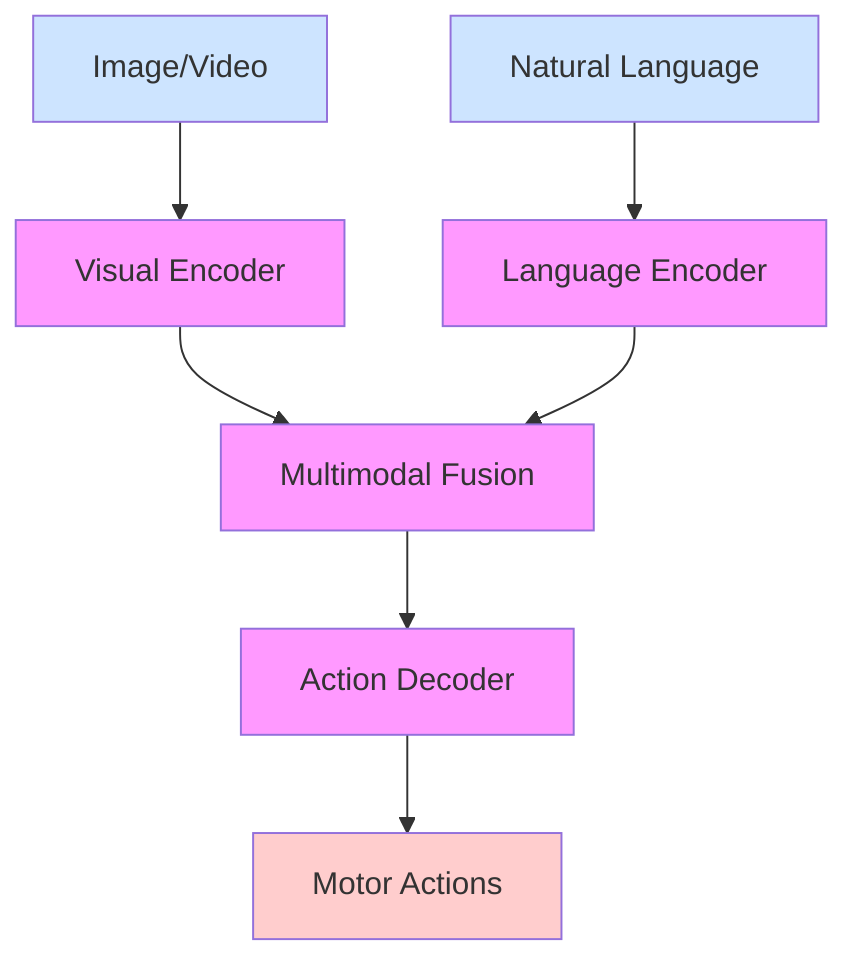

# Vision-Language-Action (VLA) Systems

## Introduction

Vision-Language-Action (VLA) systems represent the cutting edge of artificial intelligence in robotics, where visual perception, language understanding, and physical action are tightly integrated into unified intelligent systems. VLA models process visual input, understand natural language commands, and generate appropriate motor actions to complete complex tasks. This technology enables robots to interact with humans using natural language while perceiving and manipulating objects in their environment.

VLA systems have emerged as a powerful paradigm that addresses the challenge of grounding high-level language commands in low-level sensory-motor actions. Rather than treating perception, language, and action as separate modules, VLA systems learn the relationships between these modalities end-to-end, enabling more natural and flexible human-robot interaction.

## Learning Objectives

By the end of this module, you will be able to:
- Understand the architecture and components of Vision-Language-Action systems
- Implement visual perception and language understanding for robotic tasks
- Design action selection and execution modules for VLA systems
- Evaluate the performance of VLA models in robotic manipulation tasks
- Address challenges in training and deploying VLA systems
- Integrate VLA systems with existing robot platforms
- Recognize limitations and future directions in VLA research

## Understanding VLA Systems

Vision-Language-Action systems are multimodal AI architectures that jointly process visual, linguistic, and motor information. These systems differ from traditional robotics approaches that handle these modalities separately. Instead of first detecting objects in a scene, then parsing a linguistic command, and finally planning a manipulation action, VLA systems learn correlations between all three modalities simultaneously.

### Core Components of VLA Systems

1. **Visual Encoder**: Processes visual input (images, videos, 3D point clouds) to extract relevant features
2. **Language Encoder**: Processes natural language commands to extract semantic meaning
3. **Action Decoder**: Maps the combined visual and language representation to action parameters
4. **Fusion Module**: Integrates information from different modalities

### VLA Architecture Types

VLA systems can be categorized based on their architectural approach:

- **Separate Encoders with Late Fusion**: Each modality has dedicated encoders that are fused at a later stage
- **Unified Multimodal Encoder**: A single encoder processes all modalities simultaneously
- **Hierarchical Approaches**: Multiple levels of abstraction with different fusion strategies at each level



## Vision Processing in VLA Systems

The vision component of VLA systems is responsible for extracting relevant information from visual input. This may include object detection, segmentation, spatial relationships, or more abstract visual concepts that are relevant to the task.

Modern VLA systems often use convolutional neural networks (CNNs) or vision transformers (ViTs) as visual encoders. These models are typically pre-trained on large visual datasets and fine-tuned for the specific robotics task. The visual encoder outputs a feature representation that captures important visual information while discarding irrelevant details.

### Visual Representations for Action

In VLA systems, the visual representation must be suitable for action selection. This means the system needs to identify:
- Reachable objects and their affordances
- Spatial relationships between objects and the robot
- Scene context that may inform action selection
- Dynamic elements that require special attention

## Language Understanding in VLA Systems

The language component processes natural language commands and instructions. In VLA systems, language understanding goes beyond mere parsing to focus on identifying the task-relevant semantic content that informs action selection.

### Language Modalities

VLA systems handle various forms of linguistic input:
- **High-level Commands**: "Pick up the red cup" or "Move the box to the left"
- **Goal Descriptions**: "Set the table for dinner" 
- **Demonstrative Instructions**: "Do what I just showed you"
- **Abstract Goals**: "Prepare a snack" (requiring task decomposition)

### Grounding Language in Perception

A key challenge in VLA systems is grounding language in perceptual inputs. This means associating linguistic references ("the red cup") with visual objects in the scene. The system must resolve ambiguity, handle novel combinations of concepts, and understand spatial relationships expressed in language.

## Action Representation and Selection

The action component of VLA systems translates the multimodal understanding into executable robot actions. These actions can be represented in various forms:

- **End-effector Pose**: Cartesian coordinates and orientation
- **Joint Angles**: Direct joint-level commands
- **Motion Primitives**: Learned movement patterns
- **Discrete Actions**: Pick/place, open/close, etc.

### Action Space Considerations

The action space in VLA systems needs to be:
- **Expressive**: Capable of representing the full range of intended behaviors
- **Generalizable**: Able to handle objects and situations not seen during training
- **Safe**: Incorporating safety constraints and fail-safes
- **Efficient**: Allowing for rapid action selection during deployment

## VLA Training Approaches

Training VLA systems typically requires large datasets of visual, linguistic, and action demonstrations. Several approaches exist:

### Supervised Learning
Using datasets of human demonstrations that include visual observations, language annotations, and recorded actions. The model learns to predict actions given visual and linguistic inputs.

### Reinforcement Learning
Training the system through trial-and-error interaction with the environment, guided by rewards that reflect task success. This approach can learn complex behaviors but requires extensive interaction.

### Imitation Learning
Learning from expert demonstrations by mimicking the observed behavior. This approach is often combined with other techniques for better performance.

### Pre-training and Fine-tuning
Leveraging large pre-trained vision and language models, then fine-tuning them on robotics-specific data to reduce the need for extensive task-specific training data.

## Implementing VLA Systems

### Data Requirements

VLA systems require datasets with:
- **Visual Data**: Images/video of the robot and environment
- **Language Annotations**: Natural language commands corresponding to actions
- **Action Labels**: Actual actions taken in response to the visual and language inputs
- **Temporal Information**: Sequences of states and actions for dynamic tasks

### Model Architecture Example

```python
import torch
import torch.nn as nn
import torchvision.models as models

class VLAModel(nn.Module):
    def __init__(self, vocab_size, action_dim, hidden_dim=512):
        super(VLAModel, self).__init__()
        
        # Visual encoder (e.g., ResNet or Vision Transformer)
        self.visual_encoder = models.resnet18(pretrained=True)
        # Remove the final classification layer
        self.visual_encoder.fc = nn.Identity()
        
        # Language encoder
        self.lang_embed = nn.Embedding(vocab_size, hidden_dim)
        self.lang_lstm = nn.LSTM(hidden_dim, hidden_dim, batch_first=True)
        
        # Fusion module
        self.fusion = nn.Linear(2 * hidden_dim, hidden_dim)
        
        # Action decoder
        self.action_head = nn.Linear(hidden_dim, action_dim)
        
    def forward(self, visual_input, lang_input):
        # Encode visual features
        vis_features = self.visual_encoder(visual_input)
        
        # Encode language features
        lang_embed = self.lang_embed(lang_input)
        lang_features, _ = self.lang_lstm(lang_embed)
        # Take the last output
        lang_features = lang_features[:, -1, :]
        
        # Concatenate and fuse modalities
        combined = torch.cat([vis_features, lang_features], dim=1)
        fused = torch.relu(self.fusion(combined))
        
        # Decode to action space
        actions = self.action_head(fused)
        
        return actions

# Example usage
vla_model = VLAModel(vocab_size=10000, action_dim=7)  # 7-DOF robot arm

### Example 2: VLA System with CLIP Integration
```python
import torch
import torch.nn as nn
import clip
from torchvision import transforms

class CLIPBasedVLA(nn.Module):
    def __init__(self, action_space_dim, clip_model_name="ViT-B/32"):
        super(CLIPBasedVLA, self).__init__()

        # Load pre-trained CLIP model
        self.clip_model, self.preprocess = clip.load(clip_model_name)

        # Freeze CLIP parameters (optional - for fine-tuning later)
        for param in self.clip_model.parameters():
            param.requires_grad = False

        # Projection layers to map CLIP features to action space
        self.visual_projection = nn.Sequential(
            nn.Linear(512, 256),  # Adjust input size based on CLIP model
            nn.ReLU(),
            nn.Linear(256, 128)
        )

        self.lang_projection = nn.Sequential(
            nn.Linear(512, 256),
            nn.ReLU(),
            nn.Linear(256, 128)
        )

        # Action prediction head
        self.action_head = nn.Sequential(
            nn.Linear(256, 128),  # Combined size of visual and lang features
            nn.ReLU(),
            nn.Linear(128, action_space_dim)
        )

    def encode_visual(self, images):
        # Process images through CLIP visual encoder
        image_features = self.clip_model.encode_image(images)
        # Normalize features
        image_features = image_features / image_features.norm(dim=-1, keepdim=True)
        # Project to action-relevant space
        projected_features = self.visual_projection(image_features)
        return projected_features

    def encode_language(self, text):
        # Process text through CLIP text encoder
        text_features = self.clip_model.encode_text(text)
        # Normalize features
        text_features = text_features / text_features.norm(dim=-1, keepdim=True)
        # Project to action-relevant space
        projected_features = self.lang_projection(text_features)
        return projected_features

    def forward(self, images, text):
        # Encode visual and language inputs
        vis_features = self.encode_visual(images)
        lang_features = self.encode_language(text)

        # Concatenate features
        combined_features = torch.cat([vis_features, lang_features], dim=1)

        # Predict actions
        actions = self.action_head(combined_features)

        return actions

def process_command_with_vla(vla_model, image, command_text, device='cpu'):
    """
    Process a visual input and natural language command with the VLA model
    """
    # Prepare image for CLIP
    image_input = vla_model.preprocess(image).unsqueeze(0).to(device)

    # Tokenize command text for CLIP
    text_input = clip.tokenize([command_text]).to(device)

    # Get action prediction
    with torch.no_grad():
        action_prediction = vla_model(image_input, text_input)

    return action_prediction

# Example usage
device = "cuda" if torch.cuda.is_available() else "cpu"
vla_model = CLIPBasedVLA(action_space_dim=7).to(device)  # 7-DOF robot arm
```

### Example 3: Complete VLA System with Robot Interface
```python
import torch
import numpy as np
import cv2
from abc import ABC, abstractmethod

class RobotInterface(ABC):
    """
    Abstract interface for robot control
    """
    @abstractmethod
    def get_observation(self):
        """Get current robot state and sensor readings"""
        pass

    @abstractmethod
    def execute_action(self, action):
        """Execute an action in the environment"""
        pass

    @abstractmethod
    def reset(self):
        """Reset the robot to initial state"""
        pass

class VLARobotController:
    """
    Complete VLA system that integrates vision, language, and action
    """
    def __init__(self, vla_model, robot_interface):
        self.vla_model = vla_model
        self.robot_interface = robot_interface
        self.device = next(vla_model.parameters()).device

    def execute_command(self, command_text, max_steps=100):
        """
        Execute a natural language command using VLA system
        """
        for step in range(max_steps):
            # Get current observation (image + state)
            obs = self.robot_interface.get_observation()

            # Process with VLA model
            action = self.vla_model(obs['image'], obs['command_text'])

            # Execute action
            self.robot_interface.execute_action(action)

            # Check if task is complete (simplified)
            if self.is_task_complete(obs, command_text):
                print(f"Task completed in {step+1} steps")
                break

    def is_task_complete(self, obs, command_text):
        """
        Determine if the current task is complete based on observation and command
        This is a simplified implementation - real implementation would be more sophisticated
        """
        # In a real implementation, this would use more sophisticated logic
        # such as checking if a specific goal state is reached
        return False

class SimpleRobotSimulator(RobotInterface):
    """
    Simple simulator implementing RobotInterface
    """
    def __init__(self):
        self.position = [0.0, 0.0, 0.0]  # x, y, z
        self.orientation = [0.0, 0.0, 0.0]  # roll, pitch, yaw
        self.gripper_state = "open"  # "open" or "closed"

    def get_observation(self):
        """
        Get observation including a simulated image and state
        """
        # In a real implementation, this would capture an actual image
        # For simulation, we'll create a dummy image
        dummy_image = np.random.randint(0, 255, (480, 640, 3), dtype=np.uint8)

        # Add some simulated "objects" to make it more realistic
        cv2.rectangle(dummy_image, (100, 100), (200, 200), (255, 0, 0), -1)  # Blue cube
        cv2.circle(dummy_image, (300, 300), 50, (0, 255, 0), -1)  # Green circle

        return {
            'image': dummy_image,
            'state': {
                'position': self.position,
                'orientation': self.orientation,
                'gripper_state': self.gripper_state
            }
        }

    def execute_action(self, action):
        """
        Execute a 7-DOF action (for a robot arm)
        [dx, dy, dz, droll, dpitch, dyaw, gripper_action]
        """
        if len(action) >= 7:
            # Update position
            self.position[0] += action[0].item() * 0.01  # Scale down the action
            self.position[1] += action[1].item() * 0.01
            self.position[2] += action[2].item() * 0.01

            # Update orientation
            self.orientation[0] += action[3].item() * 0.01
            self.orientation[1] += action[4].item() * 0.01
            self.orientation[2] += action[5].item() * 0.01

            # Handle gripper action
            gripper_val = action[6].item()
            if gripper_val > 0.5:
                self.gripper_state = "closed"
            elif gripper_val < -0.5:
                self.gripper_state = "open"

            print(f"Action executed: pos={self.position}, gripper={self.gripper_state}")

    def reset(self):
        """Reset the robot to initial state"""
        self.position = [0.0, 0.0, 0.0]
        self.orientation = [0.0, 0.0, 0.0]
        self.gripper_state = "open"

# Example usage of complete VLA system
def run_vla_example():
    # Create models and interfaces (using dummy models for this example)
    # vla_model = CLIPBasedVLA(action_space_dim=7)
    robot_sim = SimpleRobotSimulator()

    # Create VLA controller
    # vla_controller = VLARobotController(vla_model, robot_sim)

    # Execute a command
    command = "pick up the blue cube"
    # vla_controller.execute_command(command)

    print("VLA System demo completed")

if __name__ == "__main__":
    run_vla_example()
```

### Next Steps

Capstone project will be added in the final version.